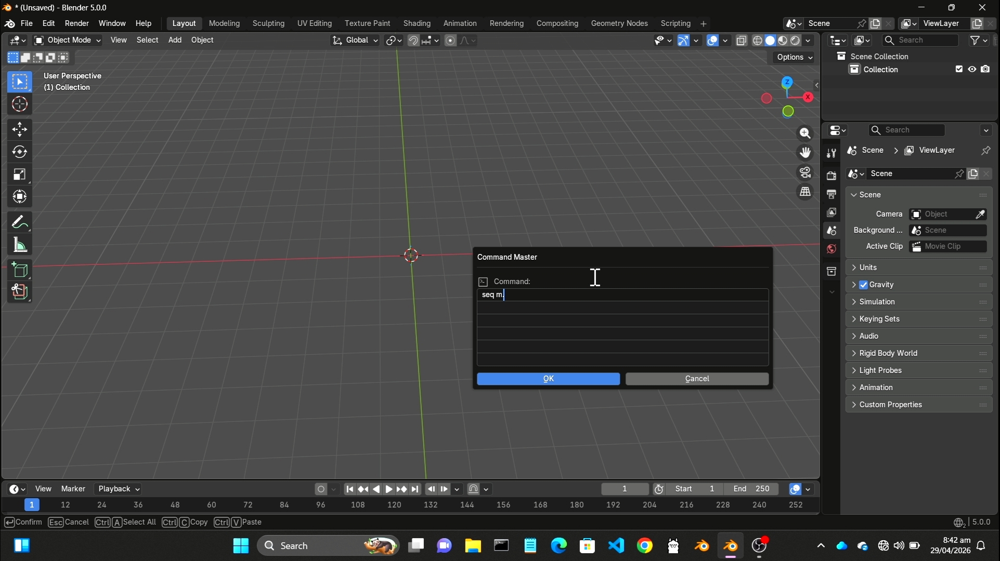
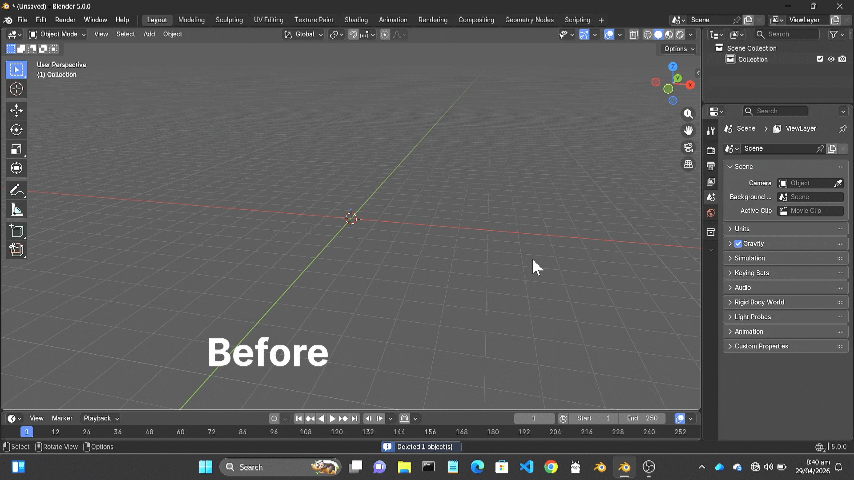
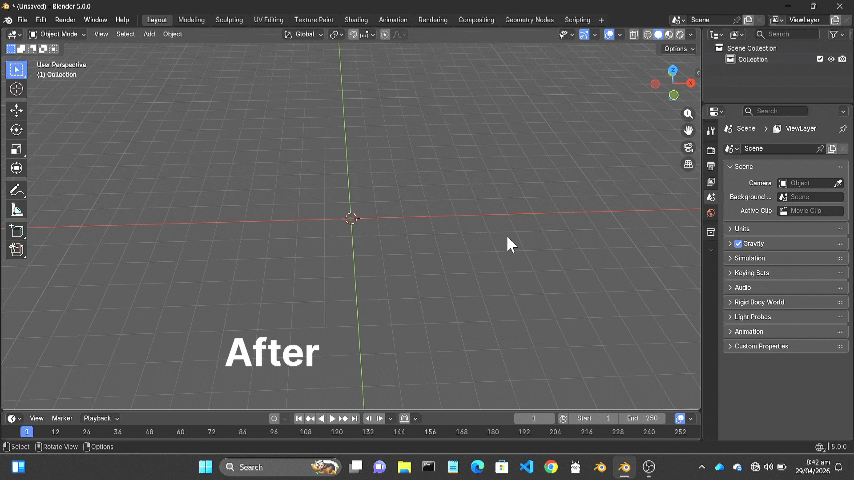

# Command Master Pro

> Turn complex Blender workflows into simple, blazing-fast commands.


---

# Command Master Pro Documentation

Welcome to the official documentation for **Command Master Pro** – “Command Master Pro is a command-based system for Blender that turns complex 3D modeling tasks into fast, simple instructions—making creation quicker, smarter, and more efficient.”



---

## What is Command Master Pro?

Blender workflows are often slow, repetitive, and full of clicks. This add-on solves that by letting you run short & powerful commands like:

- `m.c`
Add cube in your sean
- `m.c 2  1 2 3`
Add cube with size,  location x y z
- `m.c 2 1 2 3  4 5 6`
  Add cube with size,  location x y z,  rotation x y z
- `m.c 2  1 2 3  4 5 6  2 0.1 2`
Add cube with size,   location x y z,  rotation x y z,  scale x y z

👉 **work complete in seconds** 😎

---

##  Why Command Master?

Blender workflows are often **slow, repetitive, and full of clicks**, especially for repeated modeling and setup tasks.

**Command Master Pro** converts complex actions into simple commands — saving time and effort.

---

##  Features

| Feature | Description |
|---------|-------------|
|  One-line object creation | `mesh.cube.create` |
|  Smart extrude system | Parameter-based extrusions without manual dragging |
|  Automated lighting setup | 3-point lighting in one command |
|  Command-based workflow | Use Blender Text Editor or Python Console |
|  Easy to extend | Add custom commands quickly |

---

## Before vs After

| Before | After |
|--------|------|
| Add → Mesh → Cube | `m.c` |
| quick create wall | `m.c 2 0 0 0  0 0 0. 2 0.1 2 ` |
| Add → Mesh → Cylinder | `m.cy` |

---

##  Who is this for?

- Beginners learning Blender  
- Technical artists automating workflows  
- Developers who love scripting  
- Power users optimizing speed  

---

## 🎬 Demo

**🔹 Before (Manual Workflow)** <br>
Creating a simple procedural object in Blender often involves multiple repetitive steps:
- Create a cube
- Apply an array modifier
- Set count to 3 (create copies)
- Separate the copies into individual objects
- Apply subdivision surface modifier to each object one by one <br><br>
  👉 This process can take several minutes, especially when repeated multiple times.




**🔹 After (Using Command Master Pro)** <br>
With Command Master Pro, the same workflow becomes fast and effortless:
- Run a few simple commands
- Automatically create the cube
- Instantly generate array copies
- Separate objects seamlessly
- Apply subdivision to each part in one go <br><br>
  👉 What normally takes minutes is now completed in just seconds 🚀



---

##  Installation

1. Download ZIP from Releases  
2. Open Blender → Preferences → Add-ons  
3. Click Install → Select ZIP file
4. restart blender 
5. Enable “Command Master Pro”
6. ctrl+spacebar 
7. Start using commands in Blender

## Usage Guide

1. Press `Ctrl + Space` to open Command Master  
2. Type your command  
3. Press `Enter`  

👉 Done. Your task is executed instantly ⚡

---

### Example

```bash
m.c 2 0 0 0
```
👉 Creates a cube at the origin <br>
**Syntax** <br>
```bash
M.c size locX locY locZ
```
-  size = Cube size 
- locX locY locZ = Position in 3D space
🔗 For more details: [Cube Documentation](docs/Commands/Mesh/Cube/cube.md)


## 🔗 Quick Links

- [Documents Index](docs/_index.md.md)
- [Installation](docs/installation.md)
- [All Commands](docs/Commands/)
- [User Guide](#usage-guide)
- [FAQ](docs/FAQ.md)
- [Changelog](CHANGELOG.md)


## ⭐ Support the Project

If this add-on saves you time:

- Star this repo
- Report bugs
- Suggest new commands
- Share with friends


